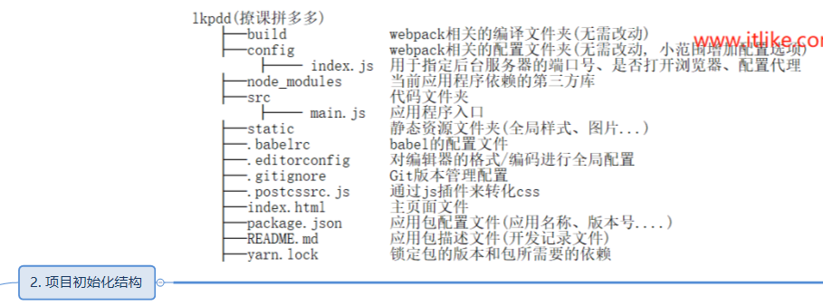
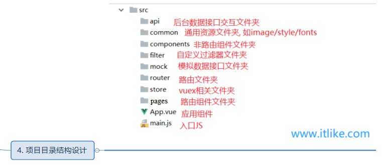

# pdd



# 初始化
    npm install vue-cli -g
    vue init webpack pdd
    cd pdd
    npm run dev

# 安装stylus依赖包 (css预编译器选择)
    npm i stylus stylus-loader --save-dev
## 使用
    <style scoped lang="stylus" ref="stylesheet/stylus"></style>

# 安装 ly-tab 移动端可滑动（惯性滑动&回弹）Vue导航栏组件
    npm i ly-tab -S

# 安装 Swiper 轮播图
    npm i swiper -save

# 安装 axios
    npm install axios --save

# 安装vuex
    可以将全局的,公用的数据与其操作方法放到vuex中
    npm install --save vuex

    src/store
      index.js
      state.js
      mutations.js
      actions.js

      mutations-type.js
      getters.js

    编写流程： index(编写一次即可)
      state [->getters] -> [mutations-type ->] actions -> mutations -> 组件中使用

# vue中数据和dom渲染由于是异步的，所以，要让dom结构随数据改变这样的操作都应该放进this.$nextTick()的回调函数中
## 方式一:
```js
//actions.js
//1.获取首页轮播图
export default{
  async reqHomeCasual({commit}, callback){
    const result= await getHomeCasual();
    commit(HOMECASUAL, {homeCasual: result.message.data})
    callback && callback()
  }
}

//Hot.vue
export default{
  computed: {
    //2.取出state中存放的数据
    ...mapState(['homeCasual']),
  },
  mounted() {
    //1.请求轮播图的数据
    this.$store.dispatch('reqHomeCasual', ()=> {  //等价于this.$store.dispatch('reqHomeCasual') + watch中的homeCasual(){}
      // debugger;
      this.$nextTick(() => {   //this.$nextTick将回调延迟到下次DOM更新循环之后执行。在修改数据之后立即使用这个方法，获取更新后的 DOM。
        //创建Swiper实例
        new Swiper('.swiper-container', {
          autoplay: true, //自动播放
          loop: true, //循环
          //如果需要分页器
          pagination: {
            el: '.swiper-pagination',
            // clickable :true,
          },
          //导航按钮
          // navigation:{
          //   nextEl: '.swiper-button-next',
          //   prevEl: '.swiper-button-prev',
          // }
        })
      });
    })
  },
}
```

## 方式二：
```js
//actions.js
//1.获取首页轮播图
export default{
  async reqHomeCasual({commit}){
    const result= await getHomeCasual();
    commit(HOMECASUAL, {homeCasual: result.message.data})
  }
}

//Hot.vue
export default{
  computed: {
    //2.取出state中存放的数据
    ...mapState(['homeCasual']),
  },
  mounted() {
      this.$store.dispatch('reqHomeCasual');  //这一步之后会将请求的数据放到state中
  },
  watch: {
    //3.监视homeCasual数据的变化
    homeCasual(pre, now){
      this.$nextTick(()=>{   //this.$nextTick将回调延迟到下次DOM更新循环之后执行。在修改数据之后立即使用这个方法，获取更新后的 DOM。
        //创建Swiper实例
        new Swiper('.swiper-container', {
          autoplay: true, //自动播放
          loop: true, //循环
          //如果需要分页器
          pagination: {
            el: '.swiper-pagination',
            // clickable :true,
          },
          //导航按钮
          // navigation:{
          //   nextEl: '.swiper-button-next',
          //   prevEl: '.swiper-button-prev',
          // }
        })
      })
    }
  }
}
```


# better-scroll 解决移动端的各种滚动场景需求的插件  --搜索页会使用到
    npm install better-scroll --save


# 使用mint-ui里面的Indicator(加载提示框)
## npm install mint-ui --save
    修改.babelrc, 实现按需引入
      npm install babel-plugin-component --save-dev 解决报错:Module build failed: ReferenceError: Unknown plugin "component" specified in
```.babelrc
{
  "presets": [
    ["env", {
      "modules": false,
      "targets": {
        "browsers": ["> 1%", "last 2 versions", "not ie <= 8"]
      }
    }],
    "stage-2"
  ],
  "plugins": ["transform-vue-jsx", "transform-runtime", ["component", [
    {
      "libraryName": "mint-ui",
      "style": true
    }
  ]]]
}
```
## import {Indicator} from 'mint-ui'
```
mounted() {
  Indicator.open({    //打开加载提示框
    text: 'Loading...',
    spinnerType: 'fading-circle'
  });
  this.$store.dispatch('reqRecommendShopList', {
    page: this.page,
    count: this.count,
    callback: ()=>{
      Indicator.close();  //关闭加载提示框
    }
  })
}
```

# 根据session中的id实现自动登录
```js
// src/api/index.js
//如存在req.session.user_id, 则可通过getUserInfo获取之前登录的用户信息, 实现自动登录
export const getUserInfo= ()=>ajax(BASE_URL+'/api/user_info');  //获取登录的用户信息

//src/store/actions.js
//7.异步获取用户信息
async getUserInfo({commit}){
  const result= await getUserInfo();
  // console.log(result)
  if(result.success_code===200){
    commit(SYNC_USER_INFO, {userInfo: result.message})
  }
},

//App.vue
created(){
  //如存在req.session.user_id, 则可通过getUserInfo获取之前登录的用户信息, 实现自动登录
  this.$store.dispatch('getUserInfo')
}

```

# 引入字体图标
## 制作字体图标的两个网站
    阿里矢量图标库 https://www.iconfont.cn/
    免费生成字体图标 https://icomoon.io/app/#/select
## 全局引入到项目中,之后根据类名即可使用字体图标
```js
//main.js
import font from './common/css/style.css'  //引入字体图标文件

//具体使用见 MeTop.vue
```

# 时间处理类库
    npm install moment --save


# 后端服务器的搭建
## 安装Express应用生成器
    npm install express-generator -g
## 设置视图模板
    express --view=ejs server
## 启动项目
    进入项目 cd server
    安装依赖 npm install
    启动项目 npm run start
## 安装mysql包
    npm install mysql --save
## 安装跨域插件
    npm install cors --save

    引入与使用
      const cors = require('cors');
      app.use(cors());


body-parser插件
const bodyParser = require('body-parser');
app.use(bodyParser.urlencoded({extended: false}));


> A Vue.js project

## Build Setup

``` bash
# install dependencies
npm install

# serve with hot reload at localhost:8080
npm run dev

# build for production with minification
npm run build

# build for production and view the bundle analyzer report
npm run build --report
```

For a detailed explanation on how things work, check out the [guide](http://vuejs-templates.github.io/webpack/) and [docs for vue-loader](http://vuejs.github.io/vue-loader).
